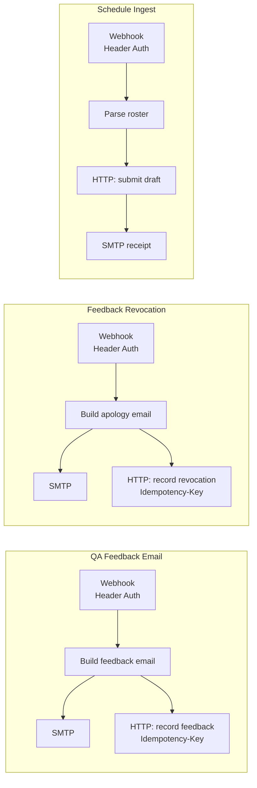

# n8n-automation-pack

Three production-style n8n workflows (feedback email, approval revocation, schedule ingest) that run locally against a Node SMTP catcher and a tiny mock API. No Docker, no cloud accounts.

## Problem

Operations teams glue n8n to mail systems, spreadsheets and chat bots, then export the workflow to share it. Those exports routinely leak instance ids, credential ids, file ids, webhook URLs and pinned execution data (real emails and phone numbers). This pack shows the workflows themselves *and* the guardrail that keeps an export publishable: a sanitizer check that runs in `npm test`.

## Workflows



Everything the workflows call is local: SMTP on `localhost:2525`, the records API on `localhost:4010`, and an HTML inbox on `http://localhost:8025`.

## Tech

Node 24 for the n8n run (the mocks and tests need only 22.13+), n8n 2.42.6 via `npx`, Hono (mock API), `smtp-server` + `mailparser` (mail catcher), `node:test`.

## Quick start

```bash
git clone https://github.com/abdalrahmnamo-svg/n8n-automation-pack.git
cd n8n-automation-pack
npm ci
npm test                      # sanitizer check + 48 tests, n8n not required
cp .env.example .env          # PowerShell: Copy-Item .env.example .env
```

## Run it

Verified against **n8n 2.42.6** on Node 24 (n8n 2.x requires Node >= 24). Use separate terminals.

```bash
npm run mock:smtp             # 1. SMTP :2525, inbox http://localhost:8025
npm run mock:api              # 2. records API :4010
npm run import                # 3. seed demo credentials, import + publish the 3 workflows
npx n8n@2.42.6 start          # 4. n8n on http://localhost:5678
```

`npm run import` is automated end to end: it generates the two demo credentials (**Header Auth (demo)** with `WEBHOOK_SHARED_SECRET` as header `x-webhook-secret`, and **SMTP (demo)** pointing at `localhost:2525`), injects their local ids into a *temporary copy* of the workflows (the shipped JSON never carries ids), runs `n8n import:credentials` and `import:workflow --separate`, then `publish:workflow` for each. Run it with n8n stopped, before step 4. State goes to `N8N_USER_FOLDER` (default `./.n8n`, git-ignored); to keep it out of the repo entirely, set `N8N_USER_FOLDER` to a temp folder first. No owner account or UI step is needed for webhooks to run.

Then trigger the workflows:

```bash
npm run trigger:feedback -- --repeat   # second call is suppressed (idempotent)
npm run trigger:revocation
npm run trigger:schedule
```

Open `http://localhost:8025` to see the emails (the schedule receipt too), and `GET http://localhost:4010/api/records` with the secret header to see the stored records. A request to a webhook without the correct `x-webhook-secret` header is rejected (403 on n8n 2.42.6). `--test` makes a trigger script hit n8n's `webhook-test` URL while the editor is listening.

Manual alternative (UI): create the two credentials yourself with the names above, import the three files from `workflows/`, pick the credentials on the nodes that show a warning, and toggle the workflows active.
### Example

Payload posted to *QA Feedback Email* (abridged):

```json
{ "agent": "Agent Alpha", "agentEmail": "agent.alpha@example.com",
  "conversationId": "Customer 0042_2026-01-15_1", "contact": "Customer 0042",
  "phone": "+1 555 0142", "totalScore": 92, "passed": true,
  "comments": "great empathy and clear next steps!!", "emailContent": "..." }
```

Resulting email in the local inbox (subject `Quality feedback - Agent Alpha`, cc `qa-lead@example.com`):

```text
Dear Agent Alpha,

Comments / Feedback:
Great empathy and clear next steps!

Guidelines:
...
Scored Interaction:
- Customer Name: Customer 0042
- Customer Phone Number: +1 555 0142
- Date: January 15, 2026

Your total quality score for this interaction: 92/100 PASS
...
```

Screenshots of the n8n canvases: _placeholder, to be captured by the repo owner (`docs/img/`)._

## Engineering notes

**Why Header Auth on every webhook.** n8n webhook URLs are bearer secrets: anyone who has the URL can fire the workflow and send mail. A path UUID alone is obscurity. Each webhook node uses n8n's Header Auth credential, so a request needs the shared secret *and* the path. The secret lives only in n8n's credential store and your `.env`, never in the exported JSON. The mock API enforces the same header (constant-time comparison) so the HTTP Request nodes prove the credential wiring.

**Idempotency and retry.** `server/feedbackDispatchService.js` is an outbox with states `held / queued / sending / sent / failed`. Every send carries an `Idempotency-Key` (`feedback:<conversationId>`; the workflows derive `revocation:<id>` the same way). Duplicate suppression works at three layers: a `sent` row is never re-sent unless `force`; concurrent calls for one conversation share a single in-flight send; and the receiving API returns the stored record with `duplicate: true` for a repeated key. Transient failures (network, 5xx, 429) retry with exponential backoff up to `maxAttempts`; 4xx such as a wrong secret is not retried; exhausted rows end `failed` and are resendable via flush. Storage and transport are injected, so all of this is unit-tested with fakes.

**How the sanitizer keeps secrets out.** `scripts/check-workflows.mjs` runs first in `npm test` and in CI. It fails on: `pinData`, `instanceId`, `versionId`, `staticData`, any workflow root `id`, any credential `id` (credentials must be named `... (demo)`), tag ids, cached file URLs, any email not at `example.com`, any URL host other than localhost, vendor/mail/spreadsheet/chat node types and keywords, non-webhook triggers, and webhooks without Header Auth or without a UUID path. Tests prove it passes the shipped JSON and fails on fixtures that violate each rule. For names and domains that are specific to you, pass a private list: `node scripts/check-workflows.mjs --denylist path/to/terms.txt` (or `DENYLIST_FILE`); the terms never enter the repo. CI also runs gitleaks.

## Limitations

- Verified end to end only on Windows with n8n 2.42.6 / Node 24.14 (import, publish, start, three triggers, emails in the catcher, records in the API, 403 without the secret). Other n8n versions are untested; the CLI commands for publishing differ between versions.
- Workflow URLs are fixed to `http://127.0.0.1:4010` (not `localhost`: n8n resolves it to IPv6 first, and the mock listens on IPv4 loopback; n8n also blocks `$env` in nodes by default). Edit the HTTP Request nodes to point elsewhere.
- Mail goes to a catcher, not a real SMTP relay; the mock API is in-memory and loses state on restart.
- The dispatch outbox uses an in-memory store; plug in a database-backed `store` (`get/put/list`) for durability. The workflows themselves do not call it; it is exercised by the trigger scripts and tests.
- A repeated feedback webhook call sends another email (the API record is deduplicated by `Idempotency-Key`, the mail is not).
- Screenshots of the canvases are not included.
- A chat-bot trigger is documented, not shipped: see [docs/chat-bot-variant.md](docs/chat-bot-variant.md).
## Background

Generalized from an internal QA-automation project; all data in this repo is synthetic and every identifier was regenerated.

## License

MIT
